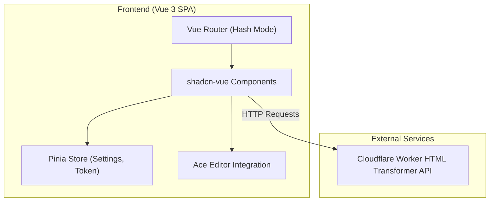

## 1. Architecture Design

## 2. Technology Description
- **Frontend Framework**: Vue 3 (Composition API, `<script setup>`)
- **Build Tool**: Vite
- **Language**: TypeScript
- **Styling**: Tailwind CSS v3 + shadcn-vue
- **Routing**: vue-router (using `createWebHashHistory` for GitHub Pages compatibility)
- **State Management**: Pinia (persisted to `localStorage` for API URL, `sessionStorage` for Auth Token)
- **Code Editor**: Ace Editor (e.g., `vue3-ace-editor` or direct integration)
- **Deployment**: GitHub Pages via GitHub Actions workflow

## 3. Route Definitions
| Route | Purpose |
|-------|---------|
| `/` | Transformer page (Request Form & Response Viewer) |
| `/cache` | Cache Update page |
| `/services` | Service Management page |
| `/settings` | Global configuration (API URL, Token) |

## 4. API Definitions
Backend API endpoints (configured via `src/assets/openapi.json` and base URL setting):
- `GET /?url={url}&format={format}` (Transformer request)
- `GET /api/services` (List services)
- `POST /api/services` (Add/Update service)
- `DELETE /api/services?id={id}` (Delete service)
- `POST /api/cache/update` (Update cache)

Authentication is handled via an optional `Authorization: Bearer <token>` header, where the token is securely stored in `sessionStorage`.

## 5. Security & State Storage
- **API URL**: Stored in `localStorage` to persist across sessions. Default: `https://proxy.cf-io.workers.dev`.
- **Auth Token**: Stored strictly in `sessionStorage`. Never included in the source code or frontend bundle.

## 6. GitHub Pages Deployment Strategy
- Vite config base set to the repository name.
- Vue Router uses hash mode to prevent 404s on refresh.
- GitHub Action workflow (`.github/workflows/deploy.yml`) installs dependencies, builds the app, and deploys the `dist` folder.
