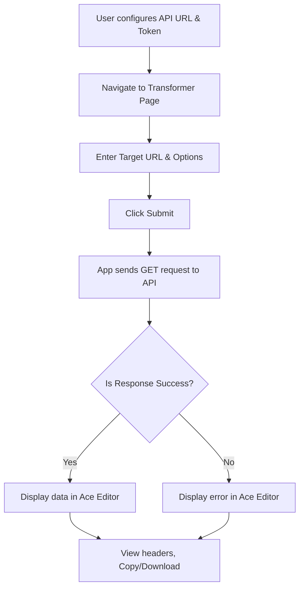

## 1. Product Overview
A simple, single-page frontend web application acting as an API client for the Cloudflare Worker HTML Transformer API.
- Designed for developers to test and interact with the transformer API.
- Features include request configuration, response viewing with syntax highlighting, cache updating, and service management.

## 2. Core Features

### 2.1 Feature Module
1. **Transformer Page**: Request form (URL, format, toggles) and Response viewer (Ace Editor, headers, copy/download).
2. **Cache Update Page**: Form to update cached content for a specific URL (HTML, JSON, Markdown, etc.).
3. **Services Page**: Manage registered services (view, add, update, delete).
4. **Settings Page**: Configure the backend API URL and an optional Bearer authentication token.

### 2.2 Page Details
| Page Name | Module Name | Feature description |
|-----------|-------------|---------------------|
| Transformer | Request Form | Target URL input, output format selector, cache toggles, service ID input, and submit button. |
| Transformer | Response Viewer | Ace Editor to display API response with correct syntax highlighting, copy/download buttons, clear response, and HTTP headers info (status, duration, cache status). |
| Cache Update | Cache Form | Input fields and Ace Editor for submitting URL, raw HTML, cleaned HTML, JSON, text, Markdown, digested content, and Cache TTL. |
| Services | Service List | View registered services. |
| Services | Service Form | Add, update, or delete a service, using Ace Editor for JSON headers and payload templates. |
| Settings | Configuration | Input fields for backend API URL and Bearer token (stored in sessionStorage). |

## 3. Core Process
The user configures their API base URL and optional token in the Settings. On the Transformer page, the user fills in the target URL and selects the desired format. The app constructs the request (e.g., `GET /?url={url}&format={format}`), sends it to the Cloudflare Worker, and displays the response in the Ace Editor with syntax highlighting based on the response content type. The user can also manage services and update the cache via dedicated pages.

## 4. User Interface Design

### 4.1 Design Style
- Developer-tool layout: Clean, utilitarian, and functional.
- Framework: shadcn-vue components with Tailwind CSS.
- Color & Theme: Support for Light and Dark modes.
- Typography: Clean sans-serif for UI, monospaced font for code editors and technical data.
- Layout: Top navigation bar, with a responsive grid/flex layout for forms and editors.

### 4.2 Page Design Overview
| Page Name | Module Name | UI Elements |
|-----------|-------------|-------------|
| Shell | Navigation | Top nav bar with links to Transformer, Cache, Services, Settings, and Dark/Light toggle. |
| Transformer | Request Form | Inputs, Select dropdowns, Switch toggles, Button. |
| Transformer | Response Viewer | Ace Editor component, badges for HTTP status/content-type, action icons (Copy, Download). |
| Cache Update | Form | Ace Editor for structured content input, text inputs, Submit button. |
| Services | Management | List/Table view, Add/Edit dialogs or inline forms with Ace Editor. |
| Settings | Config Form | Input fields for URL and Token, Save button. |

### 4.3 Responsiveness
Desktop-first approach, ensuring the developer tools are highly usable on large screens, with mobile-adaptive layout stacking columns vertically on smaller devices.
